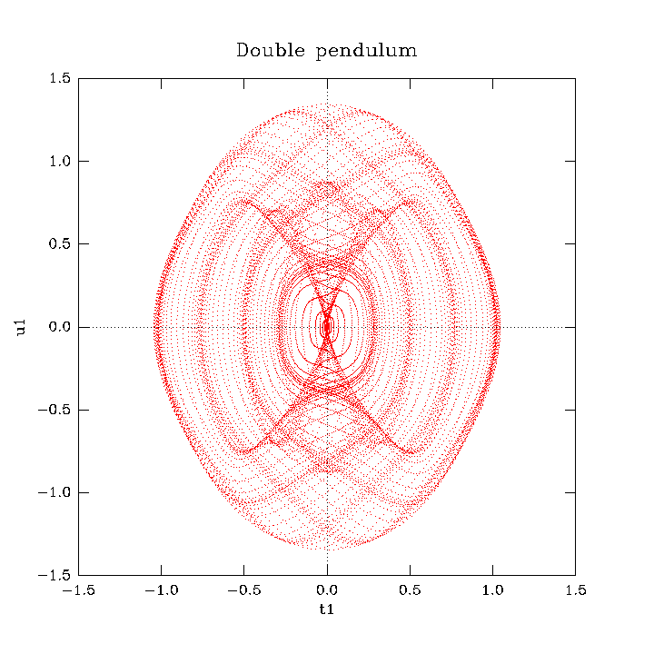

# Double pendulum

## Lagrangian dynamics

### Notation

$$
\begin{matrix}
m_i & - & \text{mass of the pendulum part} \\
\{x_i, y_i\} & - & \text{cartesian coordinates of the center of mass} \\
\mathrm{g} & - & \text{free acceleration}
\end{matrix}
$$

Lagrange's function $\mathcal{L}(\theta_i, \dot{\theta_i})$ is expressed via kinetic and potential energy $\,T - U$
 
$$
\begin{eqnarray}
T & = &
  \dfrac{m_1}{2} \Big( \dot{x_1}^2 + \dot{y_1}^2 \Big) +
  \dfrac{m_2}{2} \Big( \dot{x_2}^2 + \dot{y_2}^2 \Big) \\
U & = & m_1\mathrm{g}\,y_1 + m_2\mathrm{g}\,y_2
\end{eqnarray}
$$

### Kinematical relations

Kinematical relations are needed to represent energy values via the generalized coordinates

$$
\begin{eqnarray}
x_1 & = & \phantom{x_1}\,\phantom{+} l_1\sin\theta_1 \\
y_1 & = & \phantom{y_1} - l_1\cos\theta_1 \\
x_2 & = & x_1 + l_2\sin\theta_2 \\
y_2 & = & y_1 -l_2\cos\theta_2 \\
\end{eqnarray}
$$

### Symmetric double mathematical pendulum

Symmetry conditions (dimensionless)

$$
\mathrm{g} = 1
\qquad
m_1 = m_2 = 1
\qquad
l_1 = l_2 = 1
$$

Lagrangian

$$
\mathcal{L} = \dot{\theta_1}^2 + \dfrac{1}{2}\dot{\theta_2}^2 + \cos(\theta_1 - \theta_2)\dot{\theta_1}\dot{\theta_2} + 2\cos\theta_1 + \cos\theta_2
$$

## Equations of motion

Equations of motion in generalized coordinates

$$
\Bigg(
  \dfrac{\mathrm{d}}{\mathrm{d}t} \dfrac{\partial}{\partial\dot{\theta_i}}  - \dfrac{\partial}{\partial\theta_i}
\Bigg)
\, \mathcal{L}(\dot{\theta_i}, \theta_i) = 0
\qquad
i = \{1, 2\}
$$

System of coupled differential equations

$$
\begin{cases}
& 
  2\ddot{\theta_1} +
  \cos(\theta_1 - \theta_2)\ddot{\theta_2} +
  \sin(\theta_1 - \theta_2)\dot{\theta_2}^2 +
  2\sin\theta_1 & = & 0
\\
& 
  \phantom{2}\ddot{\theta_2} +
  \cos(\theta_1 - \theta_2)\ddot{\theta_1} -
  \sin(\theta_1 - \theta_2)\dot{\theta_1}^2 +
  \phantom{2}\sin\theta_2 & = & 0
\end{cases}
$$

Solving for $\ddot{\theta_i}$ yields

$$
\begin{cases}
& \ddot{\theta_1} & = & \dfrac{
  \phantom{2}\sin\theta_2\cos(\theta_1 - \theta_2) -
  2\sin\theta_1 -
  \sin(\theta_1 - \theta_2)
    \Big[ \phantom{2}\dot{\theta_2}^2 + \cos(\theta_1 - \theta_2)\dot{\theta_1}^2 \Big]
}{2 - \cos^2(\theta_1 - \theta_2)} & \\
& \ddot{\theta_2} & = & \dfrac{
  2\sin\theta_1\cos(\theta_1 - \theta_2) -
  2\sin\theta_2 +
  \sin(\theta_1 - \theta_2)
    \Big[ 2\dot{\theta_1}^2 + \cos(\theta_1 - \theta_2)\dot{\theta_2}^2 \Big]
}{2 - \cos^2(\theta_1 - \theta_2)}
\end{cases}
$$

### Numerical solution

#### plotutils ode

ODE description

```
# Double pendulum

t1' = u1
t2' = u2
u1' = (sin(t2)*cos(t1 - t2) - 2*sin(t1) - sin(t1 - t2)*(u2^2 + cos(t1 - t2)*u1^2)) / (2 - cos(t1 - t2)^2)
u2' = (2*sin(t1)*cos(t1 - t2) - 2*sin(t2) + sin(t1 - t2)*(2*u1^2 + cos(t1 - t2)*u2^2)) / (2 - cos(t1 - t2)^2)

t1 = 0
t2 = 3*atan(1/sqrt(3))
u1 = 0
u2 = 0

E0 = u1^2 + u2^2/2 + u1*u2*cos(t1 - t2) + 3 - 2*cos(t1) - cos(t2)

print t1, u1, t2, u2, E0
step 0, 2*192, 0.02
```

For initial conditions

$$
\theta_1=0, \quad \theta_2=\dfrac{\pi}{2}, \quad \dot{\theta_1}=0, \quad \dot{\theta_2}=0
$$



#### plotutils graph

```shell
graph -T png \
  --bitmap-size 720x720 \
  --font-size 0.03 \
  --width-of-plot 0.76 \
  --right-shift 0.12 \
  --height-of-plot 0.76 \
  --upward-shift 0.12 \
  --title-font-size 0.04 \
  -L "t=0..384" \
  -C -m -1 \
  -S 1 \
  -X "\*H_1" \
  -Y "d \*H_1 / d t"
```

## Small oscillations

Linearized equations of motion for small amplitudes

$$
\mathtt{M}\cdot\ddot{\vec{\Theta}} + \mathtt{K}\cdot\vec{\Theta} = 0
$$

where

$$
\mathtt{M} = \begin{pmatrix} 2 & 1 \\ 1 & 1 \end{pmatrix}
\qquad
\mathtt{K} = \begin{pmatrix} 2 & 0 \\ 0 & 1 \end{pmatrix}
$$

Normal frequencies

$$
\omega_{1,2}^2 = 2 \pm \sqrt{2}
\qquad
\dfrac{\omega_2}{\omega_1} = 1 + \sqrt{2}
$$

## Hamiltonian dynamics

### Momentum

$$
\begin{eqnarray}
p_1 = \dfrac{\partial \mathcal{L}}{\partial \dot{\theta_1}} & = & 
  2\dot{\theta_1} + \cos(\theta_1 - \theta_2)\dot{\theta_2} \\
p_2 = \dfrac{\partial \mathcal{L}}{\partial \dot{\theta_2}} & = &
  \phantom{2}\dot{\theta_2} + \cos(\theta_1 - \theta_2)\dot{\theta_1}
\end{eqnarray}
$$

### Hamiltonian

$$
\mathcal{H}(p_i, \theta_i) = \sum_{i=1}^2 p_i \dot{\theta_i} - \mathcal{L}
$$

For symmetric double mathematical pendulum

$$
\mathcal{H} = \dfrac{1}{2} \dfrac{p_1^2 + 2p_2^2 - 2\cos(\theta_1 - \theta_2) p_1 p_2}{2 - \cos^2(\theta_1 - \theta_2)} + 3 - 2\cos\theta_1 - \cos\theta_2
$$

### Equations of motion

Equations of motion in phase space

$$
\dot{\theta_i} = \dfrac{\partial\mathcal{H}}{\partial p_i} \qquad
\dot{p_i} = -\dfrac{\partial\mathcal{H}}{\partial \theta_i} \qquad
i = \{1,2\}
$$

$$
\begin{cases}
\dot{\theta_1} & = & \dfrac{\phantom{2}p_1 - \cos(\theta_1 - \theta_2) p_2}{2 - \cos^2(\theta_1 - \theta_2)} \\
\dot{\theta_2} & = & \dfrac{2p_2 + \cos(\theta_1 - \theta_2) p_1}{2 - \cos^2(\theta_1 - \theta_2)} \\
\dot{p_1} & = & -2\sin\theta_1 - \mathcal{W}(p_1, p_2, \theta_1, \theta_2) \\
\dot{p_2} & = & -\phantom{2}\sin\theta_2 + \mathcal{W}(p_1, p_2, \theta_1, \theta_2)
\end{cases}
$$

$$
\mathcal{W}(p_1, p_2, \theta_1, \theta_2) = \dfrac{\sin(\theta_1 - \theta_2)}{2 - \cos^2(\theta_1 - \theta_2)}
\Big(
p_1 p_2 - 2\cos(\theta_1 - \theta_2)(\mathcal{E}_0 - 3 + 2\cos\theta_1 + \cos\theta_2)
\Big)
$$

where $\,\mathcal{E}_0 = \mathcal{H}\Big\vert_{t = 0}$

