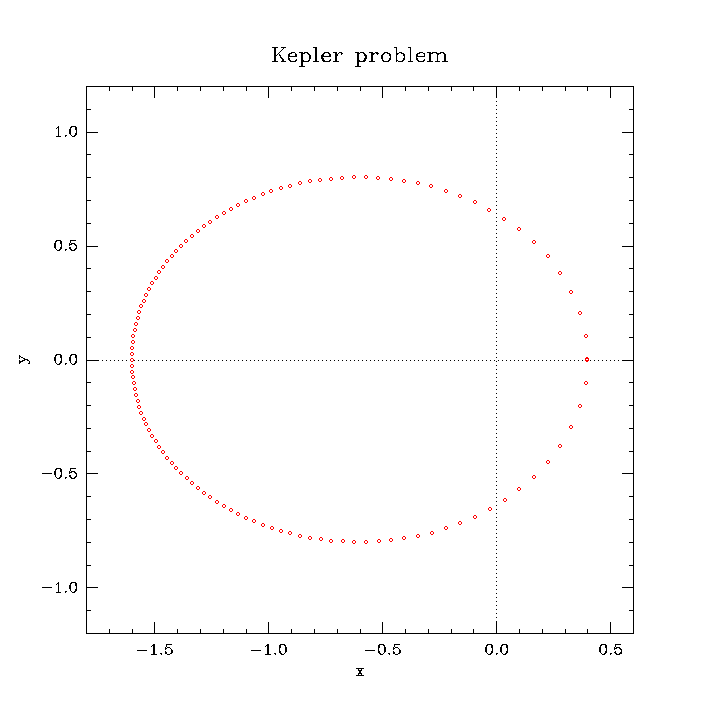

# Kepler problem

## Numerical integration

### Equations of motion

Lagrangian

$$
\mathcal{L} = \dfrac{1}{2}\big( \dot{x}_1^2 + \dot{x}_2^2 \big) + \dfrac{1}{\sqrt{ x_1^2 + x_2^2}}
$$

Equations of motion

$$
\begin{cases}
& \ddot{x}_1 & = & - \dfrac{x_1}{\big( x_1^2 + x_2^2 \big)^{\frac{3}{2}}} \\
& \ddot{x}_2 & = & - \dfrac{x_2}{\big( x_1^2 + x_2^2 \big)^{\frac{3}{2}}}
\end{cases}
$$

Constants of motion

$$
\begin{eqnarray}
\mathcal{E}_0 & = & \dfrac{1}{2}\big( \dot{x}_1^2 + \dot{x}_2^2 \big) - \dfrac{1}{\sqrt{ x_1^2 + x_2^2}} \\
L_0 & = & x_1 \dot{x}_2 - x_2 \dot{x_1}
\end{eqnarray}
$$

### Bounded orbits

Elliptical orbit with eccentricity $\epsilon = 0 \ldots 1$ and period $\,T = 2\pi$.

Initial conditions

$$
x_1 = 1 - \epsilon; \quad
x_2 = 0; \quad
\dot{x}_1 = 0; \quad
\dot{x}_2 = \sqrt{\dfrac{1 + \epsilon}{1 - \epsilon}}
$$

For $\,\epsilon = 0.6$ and $\,N=120$

